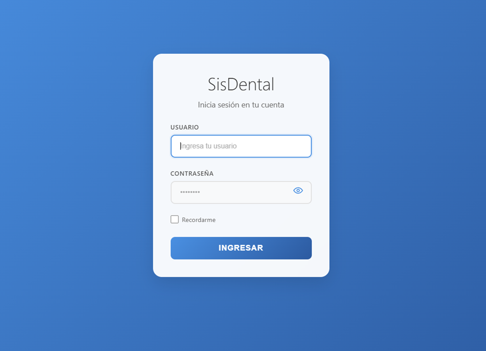
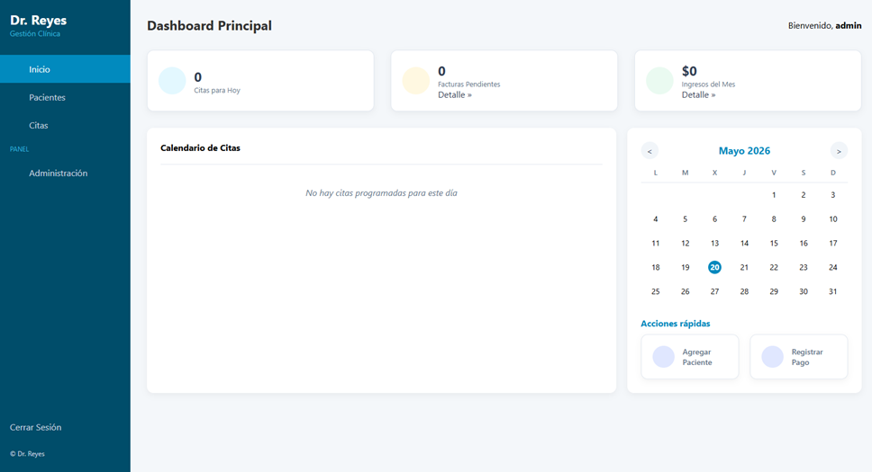
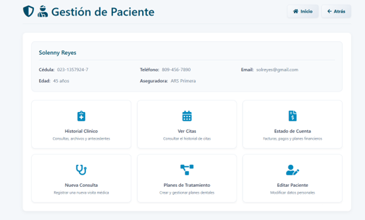
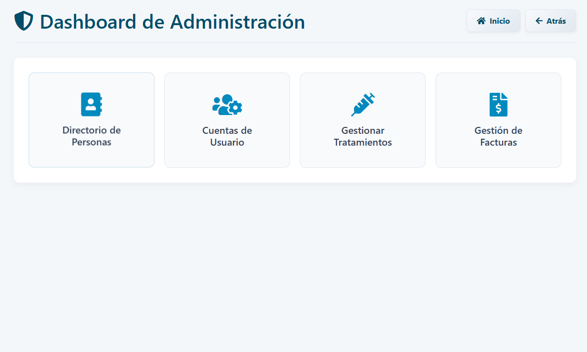

# SisDental — Dental Clinic Management System

> A web-based clinical management platform built with **Python (Flask)** and **SQLite**, designed to streamline the daily operations of a dental office — from patient intake and appointments to treatment plans and billing.

---

## 1. Authentication

SisDental uses a secure, session-based login system powered by **Flask-Login**.

### Features
- **Login** — Users sign in with a username and password. Credentials are validated case-insensitively, and passwords are stored as hashed values (never plain text).
- **Logout** — Safely ends the user session and redirects to the login page.
- **Registration** — New accounts can be created with a username and confirmed password. The system prevents duplicate usernames.
- **Route Protection** — Every page in the system is protected. Unauthenticated users are automatically redirected to the login screen.

---

### 📸 Screenshot — Login Page

---

## 2. Main Dashboard

The dashboard is the central hub of the application, providing a real-time overview of the clinic's daily activity.

### Features

#### KPI Summary Cards
Three key metric cards are displayed at the top of the page:
- **Appointments Today** — Total count of appointments scheduled for the current day.
- **Pending Invoices** — Number of unpaid invoices; clicking this card navigates to the filtered invoice list.
- **Monthly Revenue** — Total payments collected during the current calendar month; clicking navigates to the income report.

#### Interactive Appointment Calendar
- A **monthly mini-calendar** allows navigating between months (previous/next).
- Days with scheduled appointments are highlighted with a red indicator dot.
- Clicking any day filters and displays the **daily appointment agenda** below the calendar, showing each appointment's time, patient name, and attending doctor.

#### Quick Action Shortcuts
Two shortcut cards are available below the calendar:
- **Add Patient** — Directly opens the patient registration form.
- **Register Payment** — Opens the list of active treatment plans to select and process a payment.

---

### 📸 Screenshot — Main Dashboard

---

## 3. Patient Management

The patient management section provides a centralized hub for all actions related to a specific patient.

### Patient List (`/pacientes`)
- **Paginated list** of all registered patients (6 per page), sorted alphabetically.
- **Search bar** filters patients by name or ID number (cedula), ignoring dashes in the ID format.

### Patient Registration (`/crear`)
New patients are registered with the following information:
| Field | Description |
|---|---|
| Full Name | Patient's complete name |
| ID Number (Cédula) | Unique national ID — duplicates are rejected |
| Phone Number | Contact number |
| Address | Home address |
| Email | Electronic mail address |
| Insurance Provider | Name of the health insurance company |
| Insurance Number | Policy or member number |
| Date of Birth | Used to auto-calculate age throughout the system |

### Patient Editing (`/<id>/editar`)
Any of the above fields can be updated at any time by authorized users.

---

### 📸 Screenshot — Patient Management View

---

## 4. Patient Profile (Clinical Record)

Accessed via the **Patient Management** hub, the full patient profile consolidates all clinical information in one place.

### Patient Info Panel
Displays a summary of the patient's key details: name, ID, phone, email, calculated age, and insurance provider.

### Action Cards
From the patient hub, authorized users can navigate to six core sections:

| Card | Description |
|---|---|
| 🗒️ Clinical History | View consultations, medical background, and uploaded files |
| 📅 Appointments | View and manage the patient's appointment history |
| 💰 Account Statement | See all invoices, payments, and financial plans |
| 🩺 New Consultation | Open a form to record a new medical visit |
| 📋 Treatment Plans | Create or review dental treatment plans |
| ✏️ Edit Patient | Modify the patient's personal data |

### Clinical History (`/historial`)
The clinical record has two tabs:
- **Consultations Tab** — A chronological list of all past medical consultations. Each entry shows the date and diagnosis and is clickable to view full details. The most recently added consultation is automatically highlighted and scrolled into view.
- **History & Files Tab** — A form to update:
  - Family medical background (antecedentes familiares)
  - Current medications
  - File attachment upload (PDF, PNG, JPG, etc.)
  - A visual file gallery with per-file **view** and **delete** actions.
---

## 5. Appointments

> **Access:** Doctors and Assistants only.

### Appointment List (`/citas`)
- Displays all appointments in a paginated table (10 per page), ordered by most recent date.
- Can be **filtered by date** and/or by a specific **patient**.
\

## 6. Clinical Consultations

> **Access:** Doctors only.

### New Consultation (`/nuevaConsulta`)
A structured form to record a patient visit, capturing:
- **Consultation date**
- **Blood pressure** reading
- **Date of last visit** (pre-filled from the most recent consultation on record)
- **Diagnosis** — free-text clinical assessment
- **Notes** — additional observations

Data is submitted via a **JSON API endpoint** (`POST /api/consulta`), allowing for asynchronous form submission.

## 7. Treatment Plans

> **Access:** Doctors and Assistants.

### Plan List per Patient (`/paciente/<id>/planes`)
- Shows all treatment plans for a given patient, ordered by start date (most recent first).
- Paginated with 10 plans per page.

Upon creation, the system automatically generates the installment schedule and an associated invoice.

### Plan Status
Plans can have one of three statuses: **Active**, **Completed**, or **Cancelled**.

---

## 8. Administration Panel

> **Access:** Administrators only.

The admin section (`/admin`) provides system-level management tools.

## Tech Stack

| Layer | Technology |
|---|---|
| **Backend** | Python 3, Flask |
| **ORM** | SQLAlchemy (with Flask-SQLAlchemy) |
| **Database** | SQLite |
| **Authentication** | Flask-Login |
| **Templating** | Jinja2 (HTML) |
| **Frontend** | Vanilla CSS, Vanilla JS, Font Awesome icons |
| **File Storage** | Local filesystem (Werkzeug secure upload) |

---

